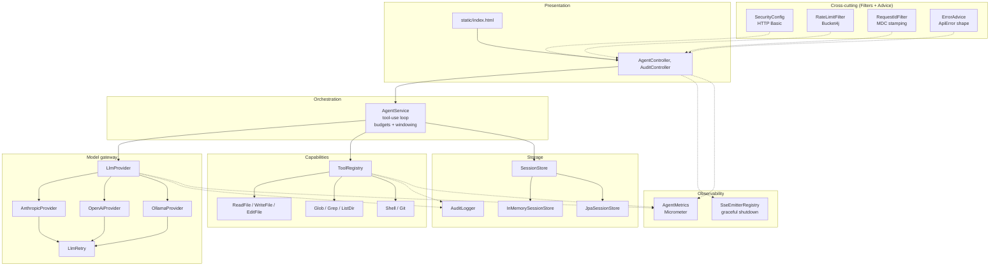

# Architecture

How Penstock is wired together, from "user types a message" to "files on disk change." Aimed at engineers joining the project and at anyone designing an extension.

---

## 1. System context

```
                        ┌──────────────────────┐
                        │  Web UI / curl / CI  │  ← user, tests, automation
                        └──────────┬───────────┘
                                   │ HTTPS (REST + SSE)
                                   │
      ┌────────────────────────────▼────────────────────────────┐
      │             Penstock (Spring Boot JVM)                │
      │                                                         │
      │   Auth ▶ Rate-limit ▶ Request ID ▶ Controller           │
      │                                         │               │
      │                                         ▼               │
      │                                 AgentService loop       │
      │                                  /            \         │
      │                    LlmProvider                ToolRegistry
      │                        │                         │      │
      │                        │                         │      │
      └───────────┬────────────┼─────────┬───────────────┼──────┘
                  │            │         │               │
             SQLite / H2    Anthropic /  Metrics    Workspace FS
             (sessions,     OpenAI /    (Prometheus) (reads/writes,
              messages,     Ollama /                  shell, git)
              audit)        Copilot API
```

Everything inside the dashed box is our code. The three external dependencies are:

1. **The LLM provider** — Anthropic / OpenAI / Ollama / GitHub Copilot API. Pluggable; selected at startup via `agent.llm.provider`.
2. **The workspace filesystem** — a single directory (set by `agent.workspace`) the agent is allowed to touch. All file/shell tools are sandboxed to this root.
3. **The database** — optional. SQLite in prod; in-memory map by default. Stores sessions, messages, and the audit log.

Nothing else is external. The agent does not need a Redis, a message broker, or anything else to run.

---

## 2. Component layers

Code is organised in layers; higher layers depend only on lower ones.



Solid arrows = strong dependency. Dotted arrows = cross-cutting (via setter injection or filter chain).

The **key insight**: `LlmProvider` and `Tool` are both interfaces with multiple implementations selected at startup. Everything else depends on the interface, not the concrete class. Swapping the LLM provider is a one-line config change; adding a new tool is a new `@Component` class.

---

## 3. Request lifecycle — `POST /api/chat/stream`

The 45-second narrative of a streaming chat request.

```
 ┌─────────────┐
 │   Browser   │  POST /api/chat/stream { "message": "read build.gradle" }
 └──────┬──────┘
        │  X-Request-Id: abc123 (optional; generated if absent)
        ▼
 ┌─────────────────────────────────────────────────────────────────┐
 │ RequestIdFilter (order: HIGHEST_PRECEDENCE)                     │
 │ - stamps MDC: requestId=abc123, userId=alice                    │
 │ - echoes X-Request-Id on response                               │
 └──────┬──────────────────────────────────────────────────────────┘
        ▼
 ┌─────────────────────────────────────────────────────────────────┐
 │ Spring Security filter chain (order: ~-100)                     │
 │ - Basic auth check (if enabled)                                 │
 │ - Populates SecurityContextHolder with Authentication           │
 └──────┬──────────────────────────────────────────────────────────┘
        ▼
 ┌─────────────────────────────────────────────────────────────────┐
 │ RateLimitFilter                                                 │
 │ - key = alice (from SecurityContext) else IP                    │
 │ - chat bucket: tryConsume(1) → ok, 29 tokens left               │
 │ - /api/health always bypasses                                   │
 └──────┬──────────────────────────────────────────────────────────┘
        ▼
 ┌─────────────────────────────────────────────────────────────────┐
 │ AgentController.chatStream                                      │
 │ - SseEmitter created, registered with SseEmitterRegistry        │
 │ - metrics.sseStreamStarted()                                    │
 │ - session resolved via agent.requireSession() or created new    │
 │ - streamExecutor.execute(runnable)  ← bounded thread pool       │
 └──────┬──────────────────────────────────────────────────────────┘
        ▼
 ┌─────────────────────────────────────────────────────────────────┐
 │ AgentService.runTurn  (tool-use loop, up to max-turns)          │
 │                                                                  │
 │  (1) append user message → SessionStore.appendMessage()         │
 │      emit SSE "message" event                                   │
 │                                                                  │
 │  (2) check session token budget; bail if exceeded               │
 │                                                                  │
 │  (3) build windowedHistory (last-N policy, preserves tool_use)  │
 │                                                                  │
 │  (4) LlmProvider.complete(systemPrompt, history, toolSpecs)     │
 │       ↓                                                         │
 │       AnthropicProvider / OpenAi / Ollama                       │
 │       ↓ HTTP POST (via WebClient)                               │
 │       LlmRetry wraps: 3 tries, exponential backoff on 429/5xx   │
 │       ↓                                                         │
 │       metrics.recordLlmCall(...)                                │
 │       auditLogger.llmCall(...)  ← @Async, fire-and-forget       │
 │                                                                  │
 │  (5) append assistant message; emit SSE "message" event         │
 │                                                                  │
 │  (6) if assistant made tool calls:                              │
 │        for each call:                                           │
 │          ToolRegistry.invoke(call, sessionId)                   │
 │            ↓                                                    │
 │            tool.execute(args)         ← ReadFile/Shell/etc.     │
 │            ↓                                                    │
 │            truncate if > max-output-bytes                       │
 │            metrics.recordToolCall(...)                          │
 │            auditLogger.toolCall(...)  ← @Async                  │
 │        append tool-result message; emit SSE "message" event     │
 │        check per-request token budget; bail if exceeded         │
 │        goto (3)                                                 │
 │                                                                  │
 │  (7) assistant produced no tool calls → done                    │
 │      emit SSE "session" event with final usage                  │
 │      emit SSE "done" event                                      │
 └──────┬──────────────────────────────────────────────────────────┘
        ▼
 ┌─────────────────────────────────────────────────────────────────┐
 │ emitter.complete()  ← onCompletion fires                        │
 │ - metrics.sseStreamFinished()                                   │
 │ - SseEmitterRegistry removes emitter                            │
 │ - MDC cleared                                                   │
 └─────────────────────────────────────────────────────────────────┘
```

**Error paths** unwind through the same pipes. Any exception thrown inside the runnable is caught, logged with the request ID, pushed to the client as an `event: error` frame, and the emitter is completed-with-error. The `ErrorAdvice` handles synchronous controller exceptions before the runnable ever starts (e.g., the session isn't found → 404 JSON response, no SSE stream).

**Client disconnection** (user hits Stop): the browser's `AbortController` closes the TCP connection. The next `emitter.send()` throws `IOException`, which bubbles up as `RuntimeException` from the message callback, which causes `AgentService.runTurn` to exit mid-loop. The registry cleans up via `onError`.

---

## 4. Data model

### Session and messages (per user)

```
┌─────────────────────────┐          ┌─────────────────────────┐
│ Session                 │  1     N │ ChatMessage             │
│─────────────────────────│──────────│─────────────────────────│
│ id           UUID       │          │ role   USER/ASSISTANT/  │
│ userId       String     │          │        TOOL/SYSTEM      │
│ title        String     │          │ text   String?          │
│ createdAt    Instant    │          │ toolCalls   List<…>     │
│ totalUsage   TokenUsage │          │ toolResults List<…>     │
│ history      List<…>    │          │ timestamp   Instant     │
└─────────────────────────┘          └─────────────────────────┘

In SQLite:
  agent_sessions(id, title, created_at, user_id)
  agent_messages(id, session_id, position, role, payload_json, timestamp)
    └── payload_json is the ChatMessage serialised; tool_calls and
        tool_results round-trip as nested JSON.
```

Storing messages as JSON blobs means tool-call shapes can evolve without schema migrations. The `position` column preserves order; `(session_id, position)` is indexed.

### Audit events (cross-user, compliance-scoped)

```
audit_events(id, timestamp, user_id, session_id, event_type, detail_json)
                                      │
                                      └─ "tool_call" or "llm_call"
                                         detail is a JSON map

Indexed on (session_id, timestamp) and (user_id, timestamp).
Read via GET /api/sessions/{id}/audit (owner-scoped).
```

One write per LLM call and per tool call. Async, so hot path isn't blocked. Retention is your call — 90 days is a reasonable default.

---

## 5. Cross-cutting concerns

| Concern | Where | What it does |
|---|---|---|
| Auth | `SecurityConfig` → Spring Security filter chain | Optional HTTP Basic; anonymous when disabled. Health + Swagger + Prometheus always open. |
| Rate limit | `RateLimitFilter` via `FilterRegistrationBean` | Bucket4j with Caffeine cache. Per-principal-else-IP. Chat bucket tighter than api. |
| Request correlation | `RequestIdFilter` (highest order) | Reads/mints `X-Request-Id`, stamps MDC (`requestId`, `userId`, `sessionId`), echoes response header. |
| Error hygiene | `ErrorAdvice` (`@RestControllerAdvice`) | Maps exceptions to the stable `ApiError` record. `@SafeMessage` marker opts in to message pass-through. |
| Metrics | `AgentMetrics` + Micrometer | Counters + gauges + timers exposed at `/actuator/prometheus`. |
| Logging | `logback-spring.xml` (profile-aware) | Plain text dev / `LogstashEncoder` JSON in `prod`. MDC flows into every line. |
| Audit | `AuditLogger` (async) | Records every LLM call + tool call to `audit_events`. No-op in memory-only mode. |
| Graceful shutdown | `SseEmitterRegistry` + `server.shutdown=graceful` | On `ContextClosedEvent` sends a `shutdown` SSE event to each active stream, then completes the emitter. |

Filters execute in this order on every request:

```
RequestIdFilter  (HIGHEST_PRECEDENCE, Integer.MIN_VALUE)
      ▼
Spring Security chain  (~ -100)
      ▼
RateLimitFilter  (LOWEST_PRECEDENCE - 100, ~ Integer.MAX_VALUE - 100)
      ▼
DispatcherServlet → Controller
```

---

## 6. Where to add / change things

| I want to… | Edit here |
|---|---|
| Add a new LLM provider | Implement `LlmProvider`, annotate `@Component` + `@ConditionalOnProperty(name="agent.llm.provider", havingValue="<name>")`. |
| Add a new tool | Implement `Tool` as `@Component`. `ToolRegistry` auto-discovers it. Add a JSON schema for its arguments. |
| Change the agent loop behaviour | `AgentService.runTurn`. Budget checks, windowing, and tool dispatch live there. |
| Swap storage backend | Implement `SessionStore`, condition it on `agent.storage.type=<name>`. Update `AgentApplication.main` if you need to tweak auto-config exclusion. |
| Add a metric | `AgentMetrics` — new method + counter/gauge/timer registration. Call from wherever the event happens. |
| Change auth | `SecurityConfig.filterChain`. Basic is the default; OIDC arrives in Phase 3. |
| Add an admin endpoint | New `@RestController`. Audit / metrics are open under the readiness probe path convention. |
| Change tool output limit | `agent.tools.max-output-bytes` in application.yml. No code change. |
| Change token budgets | `agent.llm.max-turns-per-request`, `max-tokens-per-session`, `max-tokens-per-request`. |

---

## 7. Deployment topology

### Today (single instance)

```
  ┌────────────────────────┐
  │  1 × agent container   │─── volume: /data → SQLite db
  │  (Docker or VM)        │─── volume: /workspace → the repo
  │                        │─── egress:  LLM provider
  └─────────▲──────────────┘
            │ HTTPS
            │
        [ Users ]
```

Works for a team of up to ~30 active developers behind a single-host setup. SQLite handles writes serially; Bucket4j caches bucket state in-memory. All state that matters is in the SQLite file + the workspace directory.

### Future (Phase 3 — multi-instance)

```
                 ┌──────────┐
                 │   LB     │  sticky sessions on /api/chat/stream
                 └──┬────┬──┘
                    │    │
            ┌───────▼┐ ┌─▼──────┐
            │ agent  │ │ agent  │   stateless beyond DB/cache
            └───┬────┘ └───┬────┘
                │          │
                └────┬─────┘
                     ▼
         ┌───────────────────────┐
         │     Postgres          │  replaces SQLite
         │  (agent_sessions,     │
         │   agent_messages,     │
         │   audit_events)       │
         └───────────────────────┘
```

The jump from single-instance to multi-instance requires Postgres (SQLite is single-writer), sticky sessions on the LB for SSE, and moving the rate-limit bucket store to Redis or Hazelcast so limits are shared across replicas. All three are in scope for Phase 3 of [ROADMAP.md](./ROADMAP.md).

---

## 8. Security model in one page

(Full detail in [SECURITY.md](./SECURITY.md).)

```
 Trust boundary around: the agent process + its workspace dir.

 Inside:                                 Outside:
 ─ the LLM may call any tool              ─ host filesystem beyond workspace
 ─ tools run with JVM privileges          ─ other users' sessions
 ─ users can only see their own sessions  ─ internet egress (if blocked)

 Mitigations:
 - WorkspacePath.resolve() rejects paths escaping `agent.workspace`.
 - ShellTool block-list + allow-list (opt-in).
 - Per-user session ownership in SessionStore (cross-user → 404).
 - Rate limiting per principal.
 - Token budgets per session & per request.
 - Tool output truncation prevents context flooding.
 - Docker hardening flags (read_only, cap_drop=ALL, pids_limit, mem_limit).
```

When in doubt, treat the agent like a smart contractor with a git account: useful, auditable, but every action they take gets reviewed in a PR.
